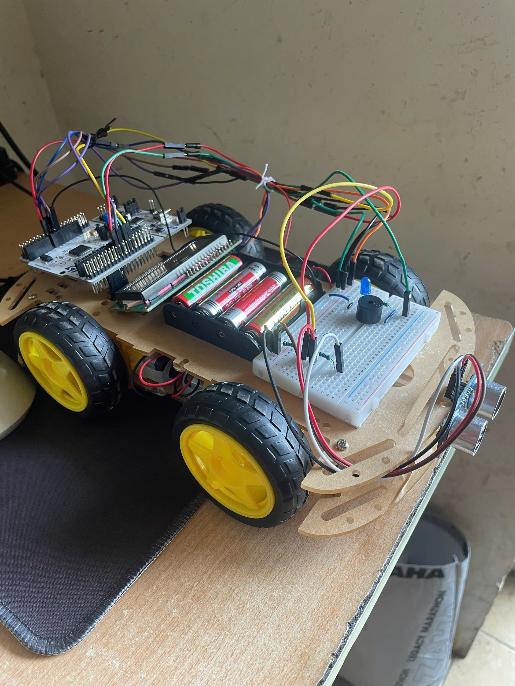

 <h1 align="center">miniADAS</h1>

## Introduction
Here is my source code and circuit diagram for miniADAS - a system have ability pre-collision warning at 3-zone safety control mechanism.

## Hardware Using
* **STM32F411RET6 Nucleo**
* **HC-SR04**
* **LCD 16x2 and PCF8754 (using I2C protocol)**
* **Motor driver L298N**
* **Brushed DC Motor**
* **Buzzer and LED**

## Final Result Visualization

   
  <i>Final Result of System Visualization</i>

